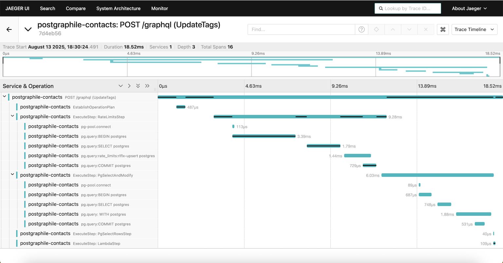

# Postgraphile OTEL Plugin

OpenTelemetry plugin for PostGraphile, providing tracing capabilities for GraphQL requests. This plugin traces:
- Errors in GraphQL requests
- Operation Planning
- Step Execution

## Installation & Usage

Install:
```bash
npm i @haathie/postgraphile-otel
```

Add to your PostGraphile config:
```ts
import { OTELPlugin } from '@haathie/postgraphile-otel';

const preset: GraphileConfig.Preset = {
	...otherOptions,
	plugins: [
		OTELPlugin,
		...otherPlugins,
	],
}
```

Of course, this assumes you have OpenTelemetry set up in your application. If you don't, you can refer to the [OpenTelemetry documentation](https://opentelemetry.io/docs/languages/js/getting-started/nodejs/) for guidance on how to set it up.
For reference, you can refer to our [example application's tracing](../contacts-example/src/tracing.ts)

An example trace looks like this in Jaeger:
