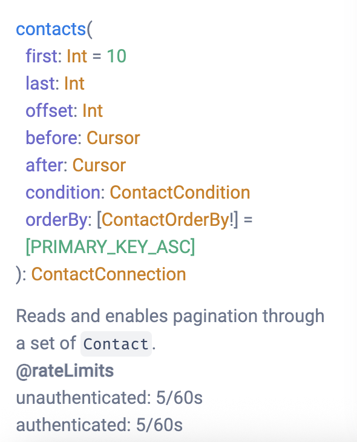

# Graphile Rate Limits Plugin

This plugin provides rate limiting capabilities for GraphQL fields, connections, and mutations in a PostGraphile application. It allows you to define rate limits based on various criteria such as user roles, field names, and more.
This is built on top of [rate-limiter-flexible](https://github.com/animir/node-rate-limiter-flexible).

## Basic Setup

1. Install the plugin:
``` sh
npm i @haathie/postgraphile-rate-limits
```
2. Add the plugin to your PostGraphile setup. You can define various rate imit types and their limits in the configuration.
``` ts
import { RateLimitsPlugin } from '@haathie/postgraphile-rate-limits';

const preset: GraphileConfig.Preset = {
	presets: [...presets],
	plugins: [
		RateLimitsPlugin,
		...otherPlugins
	],
	schema: {
		haathieRateLimits: {
			// name of the table to store rate limits
			rateLimitsTableName: 'rate_limits',
			// type of the table, can be 'unlogged' or 'logged'. Trade
			// durability for performance when using 'unlogged'.
			rateLimitsTableType: 'unlogged',
			// specify which roles must be given access to read/write to the rate limits table.
			// Enter the roles that the Graphile requests will be made with.
			rolesToGiveAccessTo: ['app_user'],
			// tell the plugin if the current request is authenticated
			// this is used to determine if unauthenticated rate limits should be applied
			isAuthenticated: (ctx) => !!ctx.user,
			// add rate limits to the GraphQL type description
			// eg. will print something like:
			// @rateLimits
			// unauthenticated: 10/60s
			// authenticated: 100/60s
			addRateLimitsToDescription: true,
			// 10 requests per minute for all unauthenticated queries, mutations, and subscriptions
			defaultUnauthenticatedLimit: { max: 10, durationS: 60 },
			rateLimits: {
				authenticated: {
					// set the default rate limits for authenticated users
					// this is applied automatically to all root level fields
					// i.e. queries, mutations, and subscriptions
					// To disable this behaviour, leave "undefined"
					default: { max: 100, durationS: 60 }, // 100 requests per minute
					// get the rate limiting key for authenticated users. If undefined,
					// then this rate limit will not be applied
					getRateLimitingKey({ user }) {
						return user?.id
					},
				}
			}
		},
	},
	..otherOpts
}

export default preset
```

By default, the plugin will apply an unauthenticated rate limit of 60 requests per minute to all root level fields (queries, mutations, and subscriptions). This can be customised by setting the `defaultUnauthenticatedLimit` property in the `rateLimits` configuration.
The unauthenticated rate limit is keyed by the IP address of the request.

Once you run Postgraphile with a config such as this, Ruru would show you something like this:


If you end up exceeding the rate limit, you'll get an error like this:
``` json
{
  "errors": [
    {
      "message": "You (some-user-id) have exceeded the \"authenticated\" rate limit for \"Contact.createdAt\". 2/10 points consumed over 60s",
      "locations": [
        {
          "line": 17,
          "column": 3
        }
      ],
      "path": [
        "contacts",
        "nodes",
        0,
        "rowId"
      ],
      "extensions": {
        "statusCode": 429,
        "headers": {
          "Retry-After": 46.798,
          "X-RateLimit-Limit": 1,
          "X-RateLimit-Remaining": 0,
          "X-RateLimit-Reset": 1752039923
        }
      }
    }
  ]
}
```

## Customising Rate Limits

Customise the rate limits for specific fields, connections, or mutations by adding the `@rateLimits` smart tag.
``` sql
CREATE TABLE app.books (
	id SERIAL PRIMARY KEY,
	name TEXT NOT NULL,
	created_at TIMESTAMPTZ NOT NULL DEFAULT NOW(),
);

-- set the rate limits for the `books` connection
-- This will limit the connection to 10 requests per minute for authenticated users
-- and 2 requests per minute for unauthenticated users
COMMENT ON TABLE app.books is $$
@rateLimits connection:authenticated:10/60s connection:unauthenticated:2/60s
$$;
```

You can also set rate limits for specific fields in a connection:
``` sql
-- set the rate limits for the `name` field in the `books` connection
-- This will limit the field to 5 requests per minute for authenticated users
COMMENT ON COLUMN app.books.name is $$
@rateLimits field:authenticated:5/60s
$$;
```

Note: this will apply the rate limits to all queries that access the `name` field in the `Book` object that gets created (not only the `books` connection).

### Customising for Specific Keys

Optionally, you can customise rate limits for specific keys (i.e. users/roles/tenants):
``` ts
const preset: GraphileConfig.Preset = {
	...otherOpts,
	schema: {
		..otherSchemaOpts,
		haathieRateLimits: {
			rateLimitsConfig: {
				authenticated: {
					// set the default rate limits for authenticated users
					// this is applied automatically to all root level fields
					// i.e. queries, mutations, and subscriptions
					// To disable this behaviour, leave "undefined"
					default: { max: 100, durationS: 60 }, // 100 requests per minute
					// get the rate limiting key for authenticated users. If undefined,
					// then this rate limit will not be applied
					getRateLimitingKey({ user }) {
						return user?.id
					},
					getRateLimit(key, { pgSettings, withPgClient }) {
						return withPgClient(pgSettings, async (pgClient) => {
							// fetch the rate limit for the user from the database
							const { rows: [row] } = await pgClient.query({
								text: 
								`SELECT max, duration_s as "durationS"
								FROM user_rate_limits WHERE user_id = $1`,
								values: [key]
							});
							return row
						});
					}
				}
			}
		}
	},
}
```

The custom rate limits returned are stored in memory via [lru-cache](https://www.npmjs.com/package/lru-cache) to avoid hitting the database/other sources for every request. You can also use the `customRateLimitsCacheOpts` property to configure the cache options.
``` ts
const preset: GraphileConfig.Preset = {
	...otherOpts,
	schema: {
		haathieRateLimits: {
			...moreRateLimitsOpts,
			// cache the rate limits for 5 minutes
			customRateLimitsCacheOpts: {
				max: 1000, // maximum number of items in the cache
				ttl: 5 * 60 * 1000, // 5 minutes
			},
		},
	}
}
```

### Customising the Rate Limiter

You can customise the rate limiter options by providing a function that returns the options based on the rate limit.
``` ts
const preset: GraphileConfig.Preset = {
	...otherOpts,
	schema: {
		haathieRateLimits: {
			...moreRateLimitsOpts,
			// customise the rate limiter options. We'll store all blocked keys in memory
			// to avoid hitting the database for keys that are blocked.
			// see: https://github.com/animir/node-rate-limiter-flexible/wiki/Overall-example#apply-in-memory-block-strategy-to-avoid-extra-requests-to-store
			rateLimiterPgOpts: l => ({ inMemoryBlockOnConsumed: l.max }),
		},
	}
}
```